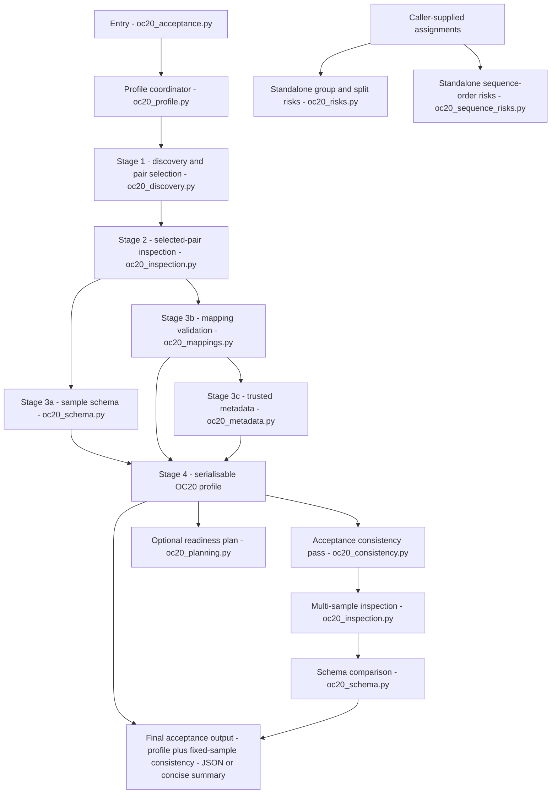

# OC20 profiler runtime module reference

## Purpose

This is the canonical lookup for the current deterministic profiler's Python
modules. It records each module's public entry points, present responsibility,
data-access boundary, and potential role in the later controlled workflow.
It complements, rather than repeats, the [Phase 1 acceptance record](oc20-profiler-phase-1-acceptance.md), which records tested behaviour and limits.

## Current boundary

All modules are deterministic and preserve `data/raw/`. They either read local
files, operate on caller-supplied evidence, or compose serialisable results.
They do not invoke an LLM, execute transformations, create derived datasets,
or provide a LangGraph workflow.

“Future tool candidate” means a Phase 2 wrapper may expose the listed typed
operation to a planner or graph after its input contract, policy checks, and
tests are approved. It does not mean an LLM may call the module directly or
that the module is already an agent tool.

## Runtime flow

Stages 1–4 are the core `profile_oc20_dataset(...)` route. Mapping validation
can report that pickle loading is not authorised; metadata profiling occurs
only after the caller explicitly authorises trusted pickle loading and a
sampled mapping key is available. The acceptance command uses the completed
profile to select the same shard pair for its separate, fixed-sample
consistency pass. `oc20_inspection.py` and `oc20_schema.py` therefore appear
twice: once for the selected sample profile and once for that multi-sample
comparison. The acceptance command combines both paths into its final JSON or
concise summary; when no valid shard pair exists, the consistency evidence is
reported as unavailable rather than invented.

The readiness plan is a caller-requested, non-executing follow-on step, not an
automatic profile action. The group/split and sequence-risk checks are also
standalone: they accept caller-supplied assignments and do not infer those
values from OC20 files. No agent, model, transformation, or user interface is
part of this runtime flow.

## Module catalogue

| Module | Public entry point | Current responsibility | Data-access and safety boundary | Future workflow role |
| --- | --- | --- | --- | --- |
| `__init__.py` | Package exports such as `discover_oc20` and `profile_oc20_dataset`. | Provides the stable import surface for the package. | No dataset access itself. | Package API only; not a tool. |
| `oc20_discovery.py` | `discover_oc20(dataset_root)` | Finds the README, supported compressed shards, and expected mapping-pickle names; pairs structure and sidecar shards by numeric filename stem. | Lists paths only. Does not decompress shards or load pickles; reports missing, duplicate, and ignored symlink counterparts. | Discovery-tool candidate. |
| `oc20_inspection.py` | `inspect_oc20_shard_pair(...)`; `inspect_oc20_shard_pair_samples(...)` | Streams paired compressed structure and sidecar files, counts records/rows, selects bounded same-index samples, and reports malformed input. | Read-only streaming; no extraction, coercion, or writing. | Internal inspection service; may be exposed through a bounded inspection tool. |
| `oc20_schema.py` | `profile_oc20_sample(inspection)` | Describes declared atom properties and lexical field types from an inspection result. | Performs no file I/O and retains raw values as strings; does not infer units or scientific meaning. | Internal schema-profiling service. |
| `oc20_metadata.py` | `profile_trusted_metadata_record(...)` | Summarises one trusted metadata record, its field shapes/types, file size, SHA-256, and raw anomaly code. | Reads a pickle only after the caller has established trust; records bounded metadata evidence rather than values. | Conditional metadata-tool candidate behind explicit trust policy. |
| `oc20_mappings.py` | `validate_oc20_mapping_keys(...)` | Checks a sampled `system_id` against trusted metadata and clean-slab mappings. | Pickle loading is denied unless `allow_pickle_load=True`; no mappings are modified and no join is fabricated. | Conditional relationship-validation tool candidate. |
| `oc20_consistency.py` | `profile_oc20_sample_consistency(...)` | Compares multiple selected samples for schema and empty-field consistency in one streamed pass. | Read-only; missing requested samples remain unknown evidence rather than passing silently. | Validation-tool candidate. |
| `oc20_profile.py` | `profile_oc20_dataset(...)` | Composes discovery, selected-pair inspection, schema, optional trusted metadata/mapping evidence, unit status, and issues into `Oc20Profile`. | Read-only; serialises fresh evidence and leaves unsupported units unresolved. | Primary Phase 2 profile-tool candidate. |
| `oc20_risks.py` | `analyse_group_split_risks(assignments)` | Detects caller-supplied groups that span explicit split labels. | Does not derive groups or split labels from OC20 files, mappings, names, or record order. | Group/split validation-tool candidate. |
| `oc20_sequence_risks.py` | `analyse_sequence_risks(assignments)` | Detects duplicate and decreasing caller-supplied positions within explicit groups. | Does not infer trajectory, reaction, or image semantics; missing inputs are warning evidence. | Sequence-order validation-tool candidate. |
| `oc20_planning.py` | `build_oc20_readiness_plan(profile, goal)` | Builds a deterministic, review-only readiness plan from aggregate profile evidence. | Does not execute operations, mutate data, call a model, or expose raw source-record values. | Policy/preflight helper; not the future LLM planner or an executor. |
| `oc20_acceptance.py` | `evaluate_oc20_acceptance(...)`; module CLI | Runs the fixed Phase 1 acceptance composition and emits JSON or a concise aggregate summary. | Read-only; mapping-pickle loading stays opt-in and output avoids raw source values. | Evaluation harness; not a normal agent tool. |

## Future wrapper rules

Phase 2 should wrap, rather than rewrite, approved deterministic operations.
Each wrapper must have a typed input/output contract, an explicit policy
decision, provenance fields, and focused tests. The initial safe operation
allow-list and LLM planning contract are maintained in [milestones](../milestones.md)
and [architecture](architecture.md).

In particular:

- A planner may request a profile, validation, or preview; it must not bypass
  the pickle-trust, unit, group, or sequence-order boundaries above.
- The policy layer decides whether an operation needs approval before an
  executor receives it.
- An executor may call only approved deterministic wrappers and writes only
  non-destructive derived output outside `data/raw/`.
- The acceptance module remains a reproducibility check for developers and
  evaluation, not an operational tool selected by an LLM.

## Related records

- [Architecture](architecture.md) — future roles, state, tool families, and
  approval policy.
- [Phase 1 acceptance](oc20-profiler-phase-1-acceptance.md) — current tested
  profiler boundary and observed evidence.
- [Evaluation plan](evaluation-plan.md) — acceptance oracles for later
  operations and source adapters.
- [Technology decisions](technology-decisions.md) — conditional LLM,
  LangGraph, and FAIR-Chem adoption criteria.
